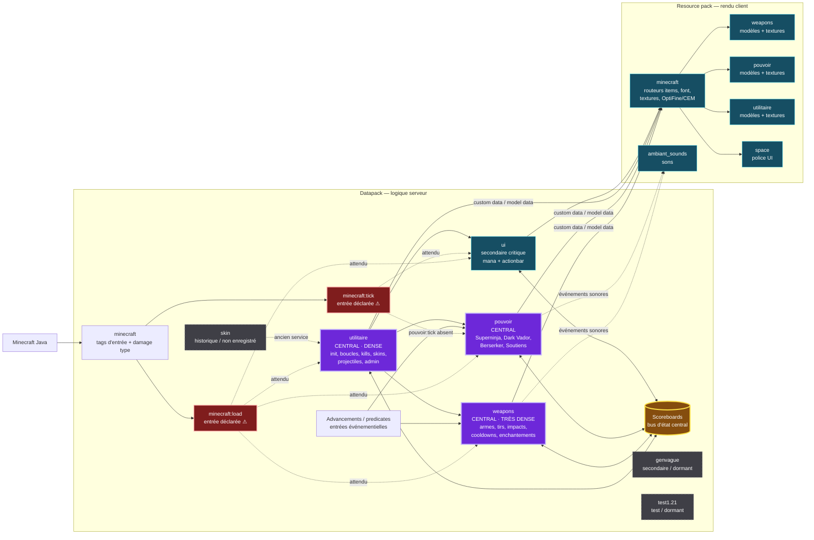
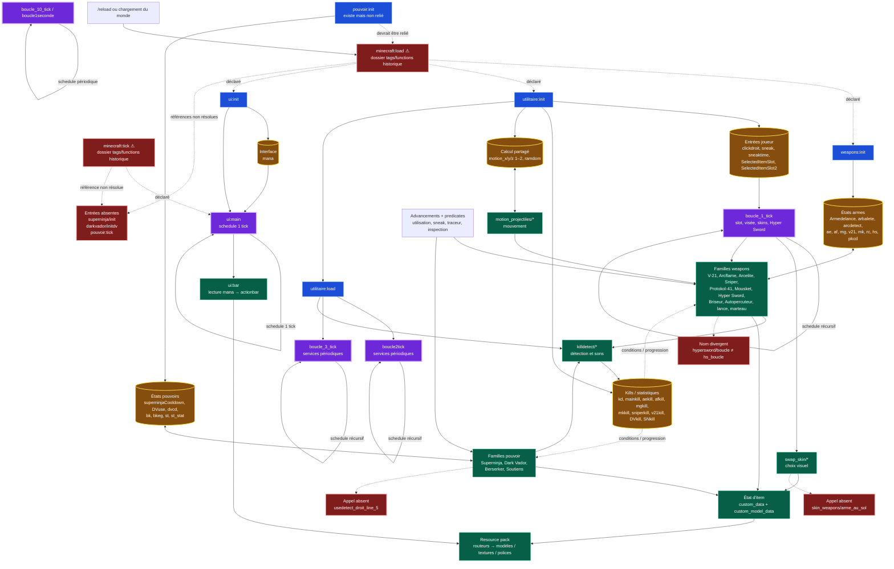

# Rapport Codex — Minecraft Java 26.1

## Décision rapide

- Version source : Minecraft Java Edition 1.21.4 probable
- Version cible : Minecraft Java Edition 26.1
- Édition : Java Edition
- Risque global : élevé, car les points d'entrée automatiques sont partiellement inopérants
- Nombre de fichiers concernés : 1 fichier documentaire ajouté ; aucun fichier Minecraft modifié
- Recommandation : utiliser cette carte comme référence pour réparer ensuite les entrées, centraliser l'ordonnancement et tester les chaînes de scoreboards

## Résumé de l'architecture

Retrowave Challenger associe un datapack de gameplay à un resource pack de rendu. Le datapack est organisé autour de trois modules centraux : `utilitaire` porte l'état partagé, les boucles et les services transverses ; `weapons` contient la majorité des systèmes de combat ; `pouvoir` gère quatre familles de capacités. `ui` projette l'objectif `mana` vers l'actionbar. `genvague`, `skin` et `test1.21` sont secondaires ou dormants dans le graphe automatique observé.

Le gameplay est piloté par quatre mécanismes complémentaires : tags `minecraft:load` et `minecraft:tick`, chaînes récursives `schedule`, advancements/predicates, et scoreboards. Les scoreboards forment le bus d'état du projet : ils mémorisent les entrées joueur, les cooldowns, les états d'armes et pouvoirs, les statistiques, le mouvement et les valeurs d'interface. Les fonctions modifient ces scores, puis d'autres fonctions les relisent pour choisir un tir, un modèle, un effet ou un affichage.

Le resource pack est une dépendance client du datapack. Les valeurs `custom_data` et `custom_model_data` choisies côté datapack sont routées par `assets/minecraft/items` vers les modèles et textures des namespaces `weapons`, `pouvoir` et `utilitaire`. Les polices `minecraft` et `space` rendent l'UI ; `ambiant_sounds` fournit les sons ; la couche OptiFine/CEM est optionnelle et distincte du rendu Vanilla.

> État important : les diagrammes distinguent le flux voulu du flux garanti. Les tags se trouvent dans le dossier historique `tags/functions`, et trois fonctions référencées par les entrées sont absentes. Les hooks peuvent donc être ignorés ou interrompus dans l'état actuel.

## Diagramme Mermaid — vue de haut niveau

## Diagramme Mermaid — flux d'exécution et logique des scoreboards

## Logique des scoreboards

Les objectifs ne forment pas une base de données isolée : ils constituent des contrats implicites entre modules. Une fonction d'initialisation crée ou initialise un objectif, une boucle ou un événement l'actualise, puis une fonction de gameplay ou d'UI le consomme. Les flèches bidirectionnelles du diagramme indiquent qu'un même domaine peut lire et écrire ses scores.

| Domaine d'état | Objectifs principaux observés | Producteurs principaux | Consommateurs / effets |
| --- | --- | --- | --- |
| Entrées et contexte joueur | `clickdroit`, `sneak`, `sneaktime`, `SelectedItemSlot`, `SelectedItemSlot2` | initialisation et boucles `utilitaire` | sélection d'arme, visée, changement de skin, pouvoirs déclenchés par usage/sneak |
| Armes | `Armedelance`, `arbalete`, `arcdetect`, `ae`, `af`, `mg`, `v21`, `mk`, `rc`, `hs`, `pkcd` | `weapons:init`, advancements et fonctions de chaque arme | cadence, cooldown, raycast, impact, recul, retour et choix d'état visuel |
| Pouvoirs | `superninjaCooldown`, `DVuse`, `dvcd`, `bk`, `bkeg`, `st`, `st_stat` | `pouvoir:init` et familles de pouvoirs | disponibilité, durée, ultime, mouvement, bouclier et effets |
| UI | `mana` | `ui:init` et logique de gameplay associée | `ui:main` puis `ui:bar`, conversion des plages de score en actionbar |
| Kills et statistiques | `Monstre_aneantie`, `kd`, `mainkill`, `aekill`, `afkill`, `mgkill`, `mkkill`, `sniperkill`, `v21kill`, `DVkill`, `SNkill` | `utilitaire:killdetect/*` et fonctions d'armes/pouvoirs | sons, statistiques, états ou progression dépendant des éliminations |
| Mouvement et aléatoire | `motion_x1`, `motion_y1`, `motion_z1`, `motion_x2`, `motion_y2`, `motion_z2`, `ramdom` | `motion_projectiles/*`, `ramdomizeur3d/*` | trajectoires, raycasts, dispersion et effets spatiaux |

### Cycle logique commun

1. `load` doit créer les objectifs et valeurs initiales.
2. Les entrées joueur et advancements produisent des événements.
3. Les boucles lisent les scores et mettent à jour états, cooldowns et sélections.
4. `weapons` et `pouvoir` consomment ces états, exécutent les effets, puis réécrivent cooldowns et statistiques.
5. `utilitaire:killdetect/*` agrège les résultats de combat.
6. `ui` lit `mana` et le resource pack traduit l'état logique en rendu.

Le risque central est l'amorçage : si `minecraft:load` n'est pas chargé, les objectifs requis peuvent ne pas exister. Le second risque est la duplication : une chaîne `schedule` démarrée plusieurs fois multiplie ses exécutions. Ces deux propriétés doivent être vérifiées en jeu avant de considérer le graphe comme opérationnel.

## Légende des modules

| Bloc | Rôle | Centralité | Densité / complexité | État observé |
| --- | --- | --- | --- | --- |
| `datapack` | logique serveur, états et événements | structure racine | élevée | présent |
| `resourcepack` | rendu des items, UI, textures et sons | dépendance client | élevée | présent |
| `minecraft:load` | initialisation automatique des modules | point d'entrée critique | moyenne | chemin historique ; deux références absentes |
| `minecraft:tick` | exécution automatique continue | point d'entrée critique | moyenne | chemin historique ; `pouvoir:tick` absent |
| `utilitaire` | orchestration, boucles, kills, mouvements, skins, admin | centrale | très dense | présent ; un appel absent |
| `weapons` | systèmes d'armes et combat | centrale | très dense | présent ; une divergence d'appel |
| `pouvoir` | capacités et cooldowns | centrale | dense | présent ; initialisation non reliée et appel absent |
| `ui` | mana et barre d'action | secondaire critique | moyenne | présent ; boucle autonome à surveiller |
| `genvague` | génération/test de vague | secondaire | faible | aucun appel automatique observé |
| `skin` | ancien changement de skin | secondaire historique | faible | dossier `functions` non enregistré |
| `minecraft` (datapack) | tags d'entrée et tag de damage type | infrastructure | faible | présent |
| `minecraft` (resource pack) | routeurs d'items, police et couche OptiFine | centrale côté client | dense | présent |
| `space` | police et glyphes de l'UI | secondaire | faible | présent |
| `ambiant_sounds` | événements et fichiers audio | secondaire | faible | présent |
| `test1.21` | particules de test | hors flux principal | faible | dormant |

### Convention visuelle

- Violet : module central ou boucle dense.
- Jaune/brun : état partagé par scoreboard.
- Bleu : initialisation ou infrastructure.
- Vert : traitement de gameplay ou rendu.
- Gris pointillé : module secondaire, historique ou dormant.
- Rouge : point d'entrée fragile, référence absente ou divergence de nom.
- Flèche pleine : dépendance ou appel observé/structurel.
- Flèche pointillée : intention, dépendance optionnelle ou flux non garanti.

## Changements critiques

- `breaking change` — confiance élevée : `data/minecraft/tags/functions` emploie le chemin historique au lieu de `tags/function`; `load` et `tick` peuvent être ignorés.
- `breaking change` — confiance élevée : `pouvoir:superninja/init`, `pouvoir:darkvador/initdv` et `pouvoir:tick` sont référencées mais absentes.
- `breaking change` — confiance élevée : trois appels internes sont non résolus ou divergents (`usedetect_droit_line_5`, `skin_weapons/arme_au_sol`, `hypersword/boucle`).
- `breaking change` — confiance élevée : `data/skin/functions` et `data/utilitaire/item_modifiers` utilisent des dossiers historiques.

## Migrations nécessaires

- `migration nécessaire` — confiance élevée : remettre en état les points d'entrée avant de valider les dépendances et scoreboards sur 26.1.
- `migration nécessaire` — confiance moyenne : revalider composants d'items, advancements, predicates, enchantements, damage type et routeurs de modèles avec les schémas 26.1.
- `migration nécessaire` — confiance élevée : confirmer que chaque chaîne `schedule` est amorcée une seule fois et qu'elle dispose de tous ses objectifs.

## Optimisations optionnelles

- `optimisation optionnelle` — confiance moyenne : créer un répartiteur `load` unique pour rendre l'ordre d'initialisation explicite.
- `optimisation optionnelle` — confiance moyenne : centraliser les cadences 1, 2, 3 et 10 ticks dans un ordonnanceur documenté.
- `optimisation optionnelle` — confiance faible : documenter chaque scoreboard avec propriétaire, valeur initiale, plage, producteurs et consommateurs.

## Nouvelles possibilités

- `nouvelle possibilité` — confiance moyenne : générer automatiquement un graphe fonction → fonction et scoreboard → fonction lors des futurs audits.
- `nouvelle possibilité` — confiance faible : isoler les états d'armes, pouvoirs et UI derrière des fonctions d'interface pour réduire le couplage direct aux scoreboards.

## Fichiers modifiés ou proposés

- `reports/official/architecture_diagram.md` : ajouté.
- Fichier de datapack ou resource pack : aucun.

## Diff résumé

- Ajout d'une documentation d'architecture avec deux diagrammes Mermaid.
- Ajout d'une cartographie logique des scoreboards et des contrats inter-modules.
- Aucun changement de commande, JSON Minecraft, modèle, texture, son ou gameplay.

## Tests automatiques effectués

- Lecture du pré-audit et de la vue d'architecture existante.
- Inventaire des namespaces, fonctions, JSON et assets déjà audités.
- Relecture des tags `load.json` et `tick.json`.
- Contrôle textuel des blocs Mermaid, des modules requis et de la distinction entre flux attendu et flux non résolu.

## Tests in-game à faire

1. Après correction future des chemins, lancer `/reload` et relever toute erreur d'objectif ou de fonction.
2. Vérifier que chaque initialiseur s'exécute exactement une fois.
3. Observer les chaînes `schedule` après plusieurs `/reload` pour détecter toute duplication.
4. Vérifier la création et l'évolution de chaque famille de scoreboards.
5. Tester une arme et un pouvoir de chaque famille, puis confirmer cooldown, killdetect, statistiques et rendu.
6. Faire varier `mana` sur ses plages et vérifier chaque état de l'actionbar.
7. Tester les modèles avec et sans la couche OptiFine/CEM.

## Sources consultées

- `docs/sources_minecraft_projet.md`.
- `reports/migrations/preaudit_26_1.md`.
- `reports/official/architecture_overview.md`.
- Tags et fonctions présents dans `datapack/retrowave-challenger/data`.
- Assets présents dans `ressourcepack/retrowavechallenger v4 1.21.4/assets`.
- Sources versionnées déjà consignées dans le pré-audit : changelogs Mojang Java 1.21 et 26.1, snapshot 25w31a et Misode Versions.

## Incertitudes / à vérifier manuellement

- À vérifier manuellement : ordre réellement voulu entre les initialiseurs `weapons`, `utilitaire`, `pouvoir` et `ui`.
- À vérifier manuellement : producteurs exhaustifs et plages valides de chaque scoreboard ; cette carte regroupe les objectifs principaux du pré-audit, pas un schéma de données formel.
- À vérifier manuellement : rôle prévu de `genvague`, `skin` et `test1.21` dans le produit final.
- À vérifier manuellement : compatibilité exacte 26.1 des commandes et composants employés, sans validation runtime dans cette étape documentaire.

Niveau de confiance global : élevé pour la structure locale, les entrées déclarées et les références absentes ; moyen pour l'interprétation des contrats de scoreboards ; faible pour l'intention des modules dormants.
